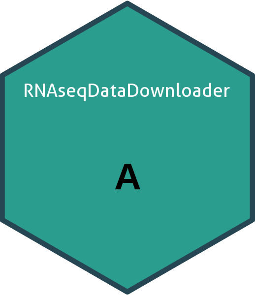

- [Tutorial for R package
  ‘RNAseqDataDownloader’](#tutorial-for-r-package-rnaseqdatadownloader)
  - [Introduction](#introduction)
- [🧬 RNAseqDataDownloader](#dna-rnaseqdatadownloader)
  - [*Download ARNSeq Public Data in
    R*](#download-arnseq-public-data-in-r)
- [📖 Overview](#open_book-overview)
  - [✅ Key Features](#white_check_mark-key-features)
- [🚀 Installation](#rocket-installation)
- [🧪 Quick Examples](#test_tube-quick-examples)
- [📚 Core Functions](#books-core-functions)
- [📊 Examples](#bar_chart-examples)
- [🤝 Contributing](#handshake-contributing)
- [📜 License](#scroll-license)
- [❓ Need Help?](#question-need-help)
- [Reference](#reference)
- [🙏 Acknowledgements](#pray-acknowledgements)

<!-- README.md is auto-generated from README.Rmd -->

<!-- README.md is generated from README.Rmd. Please edit that file -->

<!-- README.md is auto-generated from README.Rmd -->

# Tutorial for R package ‘RNAseqDataDownloader’

Lucas TRAN 10/09/2025

## Introduction

*RNAseqDataDownloader*

<div align="center">

# 🧬 RNAseqDataDownloader

### *Download ARNSeq Public Data in R*

[](https://lifecycle.r-lib.org/articles/stages.html)
[](https://github.com/yourusername/RNAseqDataDownloader/actions)
[](https://cran.r-project.org/package=RNAseqDataDownloader)
[](https://opensource.org/licenses/MIT)

<br>

> *“Classify, validate, and explore drugs with WHO ATC codes — all in
> R.”*

</div>

------------------------------------------------------------------------

## 📖 Overview

**`RNAseqDataDownloader`** is an R package that simplifies working with
**ATC codes** — the World Health Organization’s global classification
system for medicinal products. Whether you’re analyzing prescription
databases, mapping drug classes, validating inputs, or linking drug
names to codes, `RNAseqDataDownloader` provides intuitive, fast, and
reliable tools.

### ✅ Key Features

- ✔ Validate ATC code structure (L1 to L5)
- ✔ Get official WHO descriptions for any code
- ✔ Extract anatomical, therapeutic, or chemical groups
- ✔ Navigate between ATC hierarchy levels
- ✔ Fuzzy-search drug names → ATC codes
- ✔ Access built-in reference tables (updated to latest WHO version)

Perfect for **pharmacoepidemiology**, **health services research**,
**drug utilization studies**, and **clinical data science**.

------------------------------------------------------------------------

## 🚀 Installation

The code of *RNAseqDataDownloader* is freely available at
<https://github.com/vanhungtran/RNAseqDataDownloader>.

The following commands can be used to install this R package, and an R
version \>= 4.2.3 is required.

    library(devtools)
    install_github("vanhungtran/RNAseqDataDownloader")

Load the package:

``` r
library(RNAseqDataDownloader)
```

## 🧪 Quick Examples

## 📚 Core Functions

| Function            | Description                                      |
|---------------------|--------------------------------------------------|
| `is_valid_atc()`    | Validate ATC code format and structure           |
| `atc_description()` | Retrieve official WHO description                |
| `atc_level()`       | Extract code at specified level (1-5)            |
| `find_atc_code()`   | Fuzzy match drug name to best ATC code           |
| `atc_table()`       | Get full reference table of ATC codes & metadata |
| `atc_search()`      | Search codes/descriptions by keyword             |

------------------------------------------------------------------------

## 📊 Examples

Let’s explore how

``` r
```

------------------------------------------------------------------------

## 🤝 Contributing

We welcome contributions! Please see our
[CONTRIBUTING.md](CONTRIBUTING.md) guide for how to:

- Report bugs
- Suggest features
- Submit pull requests
- Improve documentation

------------------------------------------------------------------------

## 📜 License

MIT © 2025 \[Lucas VHH Tran\]

> Permission is hereby granted, free of charge, to any person obtaining
> a copy of this software…

See [LICENSE.md](LICENSE.md) for full text.

------------------------------------------------------------------------

------------------------------------------------------------------------

## ❓ Need Help?

Open an issue on
[GitHub](https://github.com/vanhungtran/RNAseqDataDownloader/issues) or
email \[<tranhungydhcm@gmail.com>\].

------------------------------------------------------------------------

<div align="center">

<br> <em>Developed with RNAseq and 🧬 for the R and health data science
community.</em> <br><br>

</div>

------------------------------------------------------------------------

<div align="center">



</div>

## Reference

## 🙏 Acknowledgements

- WHO Collaborating Centre for Drug Statistics Methodology — for
  maintaining the ATC/DDD Index
- Inspired by packages: `stringdist`, `dplyr`, `fuzzyjoin`, `rvest`
- Hex sticker design: Use `hexSticker` package or
  [hexb.in](https://hexb.in)

<!---
&#10;
4. Commit both `README.Rmd` and `README.md` to GitHub.
&#10;> 💡 Tip: Add `README.md` to `.Rbuildignore` if you don’t want it in the built package (optional).
&#10;
## 🖌️ Customize Further
- Replace `yourusername` with your GitHub username
- Replace `[Your Name or Organization]` and email
- Add your hex sticker image under `man/figures/logo.png` and uncomment the image line if desired
- Update example code to match your actual function names and outputs
&#10;
&#10;
&#10;🎁 Bonus: Generate a Hex Sticker in R
&#10;If you want to create a hex sticker, install `hexSticker` and run:
&#10;
library(ggplot2)
library(hexSticker)
&#10;# Just a centered "A" for ATC
p <- ggplot() + 
  annotate("text", x = 1, y = 1, label = "A", size = 20, fontface = "bold") +
  xlim(0.5, 1.5) + ylim(0.5, 1.5) +
  theme_void()
&#10;sticker(
  subplot = p,
  package = "RNAseqDataDownloader",
  p_size = 10,
  s_x = 1,
  s_y = 0.8,
  s_width = 1.3,
  filename = "man/figures/logo.png",
  h_fill = "#2a9d8f",
  h_color = "#264653",
&#10;)
 &#10;-->
